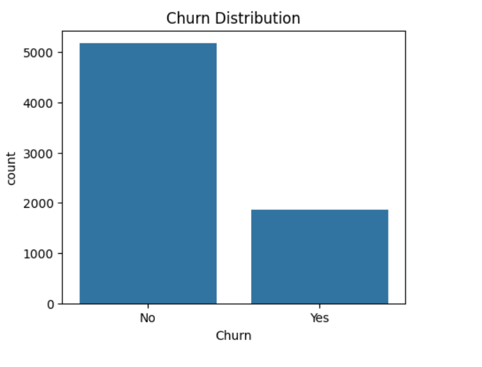
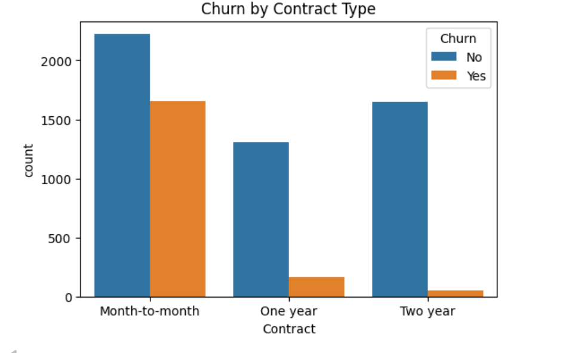
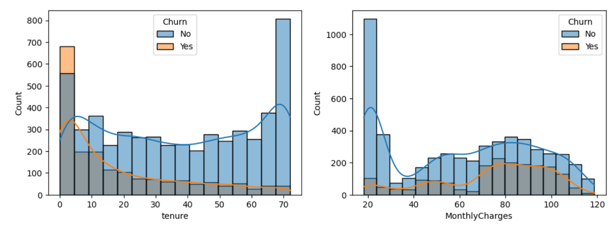
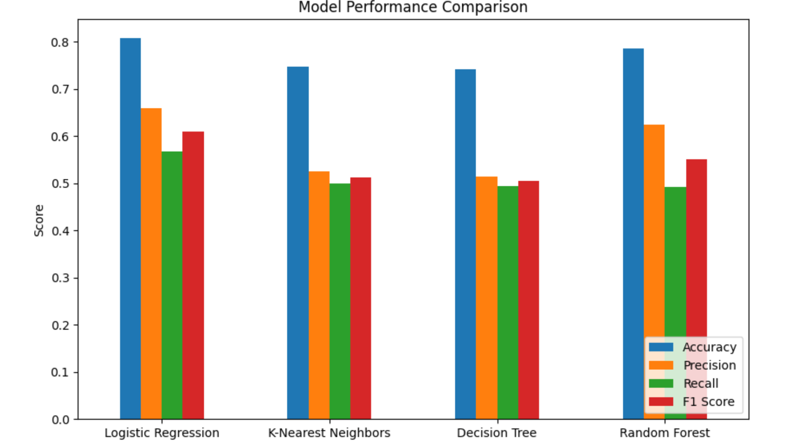
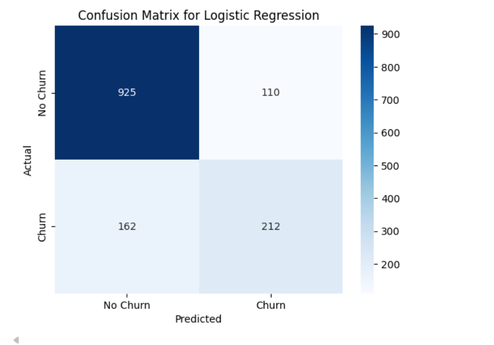
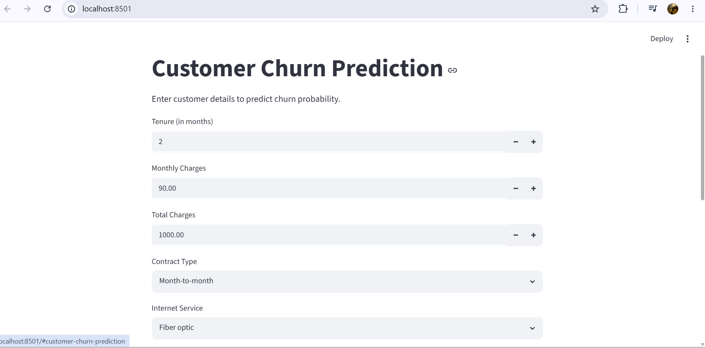

# Customer Churn Prediction

A machine learning project that predicts whether a telecom customer is likely to churn, using supervised classification algorithms. Includes a full EDA-to-deployment pipeline and an interactive Streamlit app for real-time predictions.

## 📌 Project Overview

Customer churn — when a customer stops using a company's service — is a critical metric for subscription-based businesses. This project analyzes customer behavior data to identify patterns behind churn and builds classification models to predict it, helping businesses proactively retain at-risk customers.

## 📊 Dataset

- **Source:** [Telco Customer Churn (Kaggle)](https://www.kaggle.com/datasets/blastchar/telco-customer-churn)
- **Rows:** 7,043 customers
- **Features:** 20 (demographics, account info, services subscribed)
- **Target:** `Churn` (Yes/No)
- **Class distribution:** ~73.5% No Churn, ~26.5% Churn (imbalanced)

## 🔍 Exploratory Data Analysis

Key insights from EDA:
- Customers with **month-to-month contracts** churn significantly more than those on one/two-year contracts.
- **Newer customers** (low tenure) are more likely to churn than long-term customers.
- **Higher monthly charges** correlate with higher churn likelihood.





## ⚙️ Preprocessing

- Dropped non-predictive `customerID` column
- Converted `TotalCharges` to numeric, imputed missing values with median
- Encoded target variable (`Yes`/`No` → `1`/`0`)
- One-hot encoded categorical features (`drop_first=True`)
- Stratified train-test split (80/20) to preserve class balance
- Feature scaling (`StandardScaler`) for distance/gradient-based models

## 🤖 Models Trained

| Model | Accuracy | Precision | Recall | F1 Score |
|---|---|---|---|---|
| **Logistic Regression** | **0.807** | **0.658** | **0.567** | **0.609** |
| Random Forest | 0.786 | 0.624 | 0.492 | 0.550 |
| K-Nearest Neighbors | 0.747 | 0.525 | 0.500 | 0.512 |
| Decision Tree | 0.742 | 0.514 | 0.495 | 0.504 |

**Logistic Regression** performed best overall, suggesting the relationship between features and churn is largely linear in this dataset.

Since the dataset is imbalanced, model comparison prioritized **Precision, Recall, and F1-score** over raw accuracy.




## 🚀 Deployment

An interactive **Streamlit** app was built to serve real-time predictions based on user-input customer details.



### Running the app locally

```bash
# Clone the repository
git clone https://github.com/<your-username>/customer-churn-prediction.git
cd customer-churn-prediction

# Install dependencies
pip install -r requirements.txt

# Run the app
streamlit run app.py
```

## 🛠️ Tech Stack

- **Language:** Python
- **Libraries:** pandas, numpy, scikit-learn, matplotlib, seaborn, joblib, Streamlit
- **Environment:** Jupyter Notebook (VS Code)

## 📁 Project Structure

```
customer-churn-prediction/
│
├── customer_churn.ipynb           # Full analysis: EDA, preprocessing, model training
├── train_model.py                 # Standalone training script for model/scaler export
├── app.py                         # Streamlit deployment app
├── logistic_regression_churn_model.pkl
├── scaler.pkl
├── model_columns.pkl
├── WA_Fn-UseC_-Telco-Customer-Churn.csv
├── requirements.txt
├── screenshots/
└── README.md
```

## App Link: https://customer-churn-prediction-qurssam913.streamlit.app/

## 📈 Future Improvements

- Handle class imbalance with SMOTE or class weighting to improve recall
- Hyperparameter tuning (GridSearchCV) across all models
- Add SHAP/feature importance analysis for model interpretability
- Deploy publicly via Streamlit Community Cloud

## 👤 Author

**Qurssam**
BS Artificial Intelligence, Islamia University of Bahawalpur

---

*This project was built as part of a machine learning portfolio demonstrating supervised classification, model evaluation, and deployment.*
